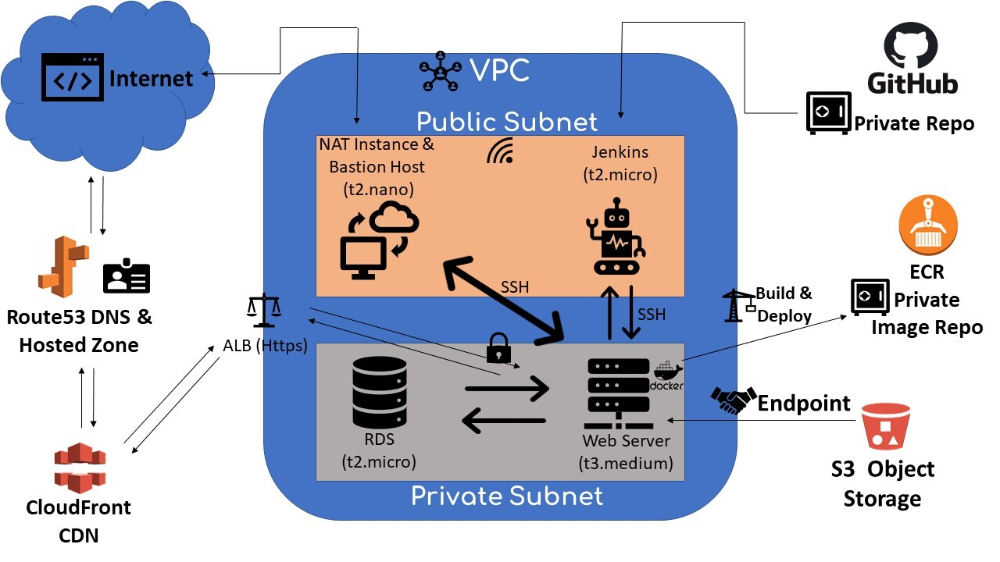

# Newshub Side Project

## Description

This is a news website project and infrastructure can be seen below.

- All recources are in the same custom VPC.
- DB (t2.micro) and webserver (t3.medium) are in a private subnet. They are in the same subnet and can connect with each other. The project runs on a Docker container on the webserver.
- NAT Instance is also a Bastion Host. Jenkins Server has been used for CI/CD pipe with private github repo(master branch and Jenkinsfile).
- ALB has a target group which consist of webserver. The target group listens webservers port 80. ALB has a redirecting rule, 80 --> 443 and also, has a certicate from AWS.
- Cloudfront for CDN (Also has a certicate from AWS. **_This certicate must be same with ALB certicate!_**)
- Route53 for DNS services and routing.

## Infrastructure Image



# Resources

## 1. Jenkins Server's Userdata (It is located on us-east-1a Public Subnet)

When a webhook is triggered by GitHub, Jenkins server, uses webserver as a node, starts the pipeline and sends essential commands to the node.

This user data installs the server these tools:

1. git
2. java for jenkins
3. jenkins
4. docker (set as agent of Jenkins)
5. Docker-compose
6. AWS CLI 2

### User Data

```bin/bash
#! /bin/bash
yum update -y
hostnamectl set-hostname jenkins-server
yum install git -y
yum install java-11-amazon-corretto -y
wget -O /etc/yum.repos.d/jenkins.repo https://pkg.jenkins.io/redhat/jenkins.repo
rpm --import https://pkg.jenkins.io/redhat/jenkins.io.key
yum install jenkins -y
systemctl start jenkins
systemctl enable jenkins
amazon-linux-extras install docker -y
systemctl start docker
systemctl enable docker
usermod -a -G docker ec2-user
usermod -a -G docker jenkins
cp /lib/systemd/system/docker.service /lib/systemd/system/docker.service.bak
sed -i 's/^ExecStart=.\*/ExecStart=\/usr\/bin\/dockerd -H tcp:\/\/127.0.0.1:2375 -H unix:\/\/\/var\/run\/docker.sock/g' /lib/systemd/systemdocker.service
systemctl daemon-reload
systemctl restart docker
systemctl restart jenkins
curl -L "https://github.com/docker/compose/releases/download/1.26.2/docker-compose-$(uname -s)-$(uname -m)" \
-o /usr/local/bin/docker-compose
chmod +x /usr/local/bin/docker-compose
# uninstall aws cli version 1
rm -rf /bin/aws
curl "https://awscli.amazonaws.com/awscli-exe-linux-x86_64.zip" -o "awscliv2.zip"
unzip awscliv2.zip
./aws/install
```

## 2. Webserver Userdata (It is located on us-east-1a Private Subnet)

This instance is not only the webserver but it is also a node of Jenkins server. When Jenkins is triggered the pipeline, the Webserver pulls the source code from _private_ repo from GitHub, _builds_ a docker image, _pushes_ this image to ECR, _delete_ all intermediate containers, and _stops_ former container, and then _starts_ new container.

This user data installs the server these tools:

1. git
2. docker
3. java for jenkins (_necesseray for being agent_)
4. Docker-compose (Could be neccesarry for project)
5. AWS CLI 2

### User Data

```bin/bash
#! /bin/bash
yum update -y
hostnamectl set-hostname web-server
yum install git -y
yum install java-11-amazon-corretto -y
amazon-linux-extras install docker -y
systemctl start docker
systemctl enable docker
usermod -a -G docker ec2-user
systemctl restart docker
curl -L "https://github.com/docker/compose/releases/download/1.26.2/docker-compose-$(uname -s)-$(uname -m)" \
-o /usr/local/bin/docker-compose
chmod +x /usr/local/bin/docker-compose
rm -rf /bin/aws
curl "https://awscli.amazonaws.com/awscli-exe-linux-x86_64.zip" -o "awscliv2.zip"
unzip awscliv2.zip
./aws/install
```

## 3. NAT instance & Bastion Host Userdata (It is located on us-east-1a Public Subnet)

This instance is used for accessing the webserver and also webserver updates its packages by this instance.

### User Data

```bin/bash
#! /bin/bash
yum update -y
hostnamectl set-hostname nat-instance
```

For configuration, from EC2 instance menu NAT instance's,

```
Actions\Networking\Change Source Destination
```

must be

```
Stop
```

You can see the picture below.


Also, from VPC menu, route table of private subnet should be editted. It must allow to connections on NAT instance.

## 4. RDS (It is located on us-east-1a Private Subnet)

RDS' security group only accepts entries from webserver's security group. It is also closed for public access by default.

## 5. S3 Bucket for Object Storing (Bucket is on us-east-1)

S3 is used for image and video storage of the website. To fast and safe communication between webserver and S3 bucket an _Endpoint_ created from VPC menu.

## 6. CloudFront for CDN

For cost management, preventing latency, and security reasons, CloudFront service has been used.

- Origin of CloudFront Distribution is _**custom1**.domain.com_.
- Also, CNAME of CloudFront distribution is _www.domain.com_.
- To get the best performance from the distribution all edge locations has been used.
- Origin Policy has been designated as _Match Viewer_.
- Viewer Protocol Policy redirects HTTP to HTTPS.
- _**SSL certificate is same with ALB certificate.**_

## 7. Route53 for DNS

A hosted zone created for this project, and records (subdomains) created for ALB and CloudFront.

- _**custom1**.domain.com_ is used for ALB,
- _www.domain.com_ is used for CloudFront.

## 8. ECR (Elastic Container Registry)

The project runs on a single container and the image of the container is built during the pipeline. For agility and restart scenarios, images always are pushed to ECR _private_ repo.
